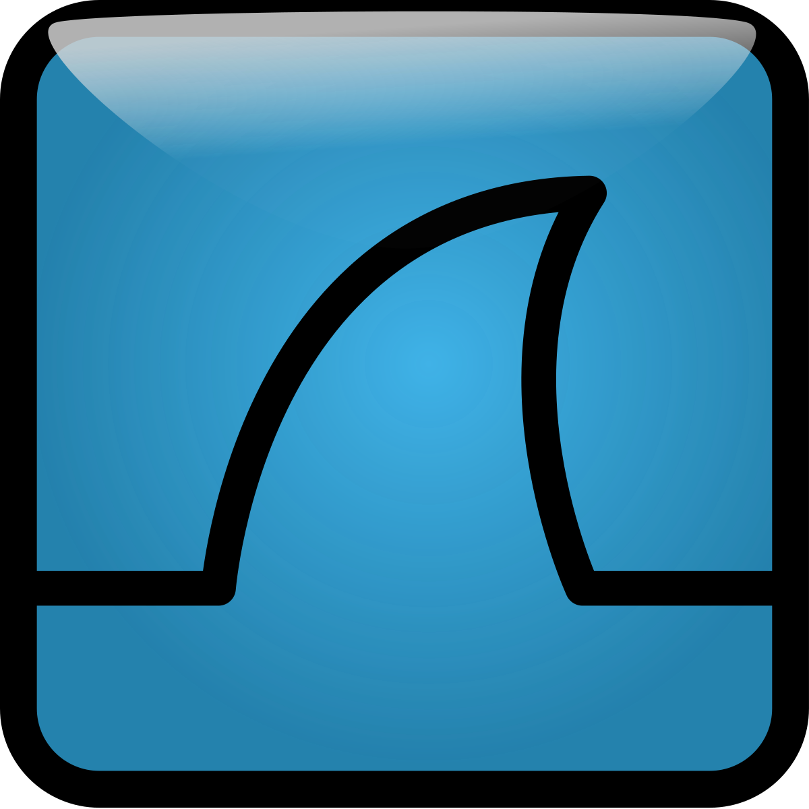
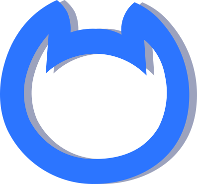

<h1 align="center">Hi 👋, I'm 0dxy</h1>
<h3 align="center">a highly skilled professional responsible for designing, implementing, and maintaining secure computer systems and networks</h3>

  

- 🔭 I’m currently working on **CTF, Other Things**

- 👨‍💻 All of my projects are available at [https://tryhackme.com/p/0dxy](https://tryhackme.com/p/0dxy)

- 💬 Ask me about **CTF,CyberSecurity**

- 📫 How to reach me **https://tryhackme.com/p/0dxy**

- ⚡ Fun fact **I Am Nice**

<h3 align="left">Connect with me:</h3>

## Languages and Tools 

### Languages:
| Python3 | C | JS | Solidity | GO |
|----------|----------|----------|-----|-----|
|   |   |   |  |  | 

  

### Best frameworks and main libraries for Python3:

| Pytorch | Selenium | Numpy | Pandas | Sklearn | OpenCV |
|----------|----------|----------|----------|----------|----------|
|  |  |  |  |  | |

### My tools for Data Manipulation & Visualisation:

| Conda | Jupyter | Spark | MySQL | Postgres | SQLite | Plotly | Matpltlib |
|----------|----------|----------|----------|----------|----------|----------|----------|
||||||| |  |

  
### Environments, Testing, Other:

| nodejs | Git | Docker | Pytest | Swagger | Postman | VBox | HardHat |
|----------|----------|----------|----------|----------|----------|----------|----------|
|||||  |  || |

### OS:

| Linux | Ubuntu | Kali |
|----------|----------|----------|
|  |  |  |

### Tools for CTF's
 
| Metasploit | Wireshark | Burpsuite | Netcat | Nmap |
|----------|----------|----------|----------|----------|
||||||

<!--

&nbsp;

